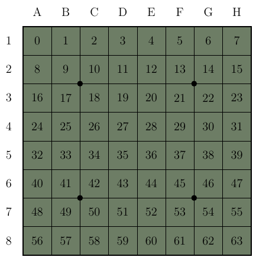

# Protocol format
- `<argument>` required argument.
- `<argument>^n` required argument precisely n times. 
- `[argument]` optional input or argument.
- `[argument]*` optional input or argument 0 or more times.
- `[argument]+` optional input or argument 1 or more times.
# List of commands

## Server-side commands
- [HELLO](#hello-server)
- [LOGIN](#login-server)
- [ALREADYLOGGEDIN](#alreadyloggedin-server)
- [LIST](#list-server)
- [NEWGAME](#newgame-server)
- [MOVE](#move-server)
- [GAMEOVER](#gameover-server)

## Client-side commands
- [HELLO](#hello-client)
- [LOGIN](#login-client)
- [LIST](#list-client)
- [QUEUE](#queue-client)
- [MOVE](#move-client)

# Command format
The different arguments of commands are separated by a tilde ("`~`"). A tilde is never allowed as part of any argument, except if explicitly indicated otherwise. All other characters, such as spaces, are allowed.

Commands are separated by newlines (`\n`). These newlines are omitted from the descriptions below.  

# Extension handling
In the arguments of the `HELLO` commands, both server and client indicate their supported extensions. During the remainder of the connection, both parties respect this by only sending commands they know the other party supports. For example, global chat messages are only delivered to those clients supporting the `CHAT` extension. Similarly, the client will not send the `NOISE`  handshake messages if it has seen that the server does not support the `NOISE` extension. 

# Error handling
When provided with illegal inputs, the server or client can respond with an error. The command that triggered the error will otherwise be discarded within the server or client. For example, when a client sends a `MOVE` but the move is not a legal move of the current player, then an `ERROR` is sent as the client could have known that the move would be illegal. 

*Syntax*: `ERROR[~description]`

The description is entirely optional. It can be added for debugging convenience. It should explicitly *never* be shown to the user, since its contents are unknown when connecting with software produced by a different group.

# Initialization sequence (handshake)
Before being able to play games, server and client need to exchange information. This is done during the handshake. No other commands are allowed until the initialization sequence has completed. A handshake consists of exchanging `HELLO` messages, optionally establishing encryption using the Noise protocol, followed by using `LOGIN` to claim a username on the server. The client initiates by sending the `HELLO` message.

## HELLO (client)
The initial message sent by the client once a connection has been established. 

*Syntax*: `HELLO~<client description>[~extension]*`

The client description should be a short string. The client indicates which extensions are supported by including the relevant extension string at the end. Extensions are given in arbitrary order. 

### Examples
- `HELLO~Client by Alice` if no extensions are supported
- `HELLO~Bob's client~CHAT~RANK` if `CHAT` and `RANK` are supported
- `HELLO~Client~RANK~CHAT` is also legal, if the same extensions are supported (since order does not matter).

## HELLO (server)
The response to the initial `HELLO` by the client. The message details are the exact same as for the client. 

*Syntax*: `HELLO~<server description>[~extension]*`

### Examples
- `HELLO~Server by Alice` if no extensions are supported
- `HELLO~Welcome to the server made by Bob!~CHAT~RANK` if `CHAT` and `RANK` are supported
- `HELLO~Server~RANK~CHAT` for the same list of extensions.

## LOGIN (client)
Sent by the client to claim a username on the server. When there is already a
client logged in with this username, the server should respond with
`ALREADYLOGGEDIN`, and the client should try a different username. Otherwise,
the server will respond with `LOGIN`. 

*Syntax*: `LOGIN~<username>`

### Examples
- `LOGIN~Alice`
- `LOGIN~Johnny Flodder`

## LOGIN (server)
Sent as a response to a successful login attempt by the client. This marks the end of the handshake. 

*Syntax*: `LOGIN`

## ALREADYLOGGEDIN (server)
Sent as a reply to a `LOGIN` command from the client, when there is already a client connected to the server using this username. The client should try again with a different username.

*Note: If the server supports the `NOISE` extension and the username is already claimed using a (different) public static key, then this command is also used as a reply. See [the document](extensions/noise.md) for more details.*

*Syntax*: `ALREADYLOGGEDIN`

# Non-initialization commands
Once handshake is finished, other commands become available to the server and client. Note that commands may still be untimely, such as a `NEWGAME` sent by a server to a client who already is in a game. For such untimely commands, an `ERROR` should be sent by the receiving party. 

The descriptions below list the details for the different commands. It is indicated in the title of each section which party is allowed to send that command. 

## LIST (client)
Sent by a client to request a list of clients who are currently logged into the server. Allowed at any point once the client is logged in, including during a game.

*Syntax*: `LIST`

## LIST (server)
Sent by the server as a reply to a `LIST` command from a client. Lists the different usernames that are currently logged into the server, including the requesting client. The order of the usernames can be arbitrary. 

*Syntax*: `LIST[~username]*`

### Examples
- When Alice is the only active client: `LIST~Alice`
- When Alice, Bob and Charlie are all on the server: `LIST~Charlie~Alice~Bob`

## QUEUE (client)
Sent by the client to indicate that it wants to participate in a game. The server will place the client at the back of the queue of waiting players. When the command is issued a second time, the client is removed from the queue. The server does not send a reply.

*Syntax*: `QUEUE`

## NEWGAME (server)
Sent by the server to all players that are put into a newly-started game. Only players that were queued (see [QUEUE](#queue)) are allowed to be put into a game. A player can only be in at most one game simultaneously. 

The first parameter for this command is the name of the first player.
The second parameter is the name of the second player.

The first player is allowed to make the first move. 

*Syntax*: `NEWGAME~<player1 name>~<player2 name>`

### Examples
For a new game between Alice and Bob: `NEWGAME~Alice~Bob`

## MOVE (client)
Sent by the client to indicate which row(s) or column(s) the player wants to push. Only allowed when it is the player's turn.

*Syntax*: `MOVE~<N>`

A move is encoded as a single integer `N`. 
* If `0 <= N <= 63` then it represents placing a disc on a square of the game board, starting in the top left corner:
	* `A1` is `0`
	* `H1` is `7`
	* `A8` is `56`
	* `H8` is `63`
* If `N == 64` then it represents the passing move.

See the following image for a visualisation of the encoding of `N` on the game board.

If the move is legal, the server sends the move to all players as defined in [MOVE (server)](#move-server). Note that if the server deems the move to be illegal, an `ERROR` is sent in reply instead. Also, since fields D4, E4, D5 and E5 are occupied from the start, moves `27`, `28`, `35` and `36` are always illegal.

## MOVE (server)
Sent by the server to indicate the next move that is played. This is sent to all players in the game, including the player who performed the move. 

*Syntax*: `MOVE~<move>`

The move is encoded in the same way as [when sending the move to the server](#move-client). 

### Examples
- `MOVE~15`
- `MOVE~64`

## GAMEOVER (server)
Sent by the server to indicate the end of a game. The server provides the winning player and the reason for the end of the game. 

*Syntax*: `GAMEOVER~<reason>[~winner]`

The winner is always included when the game did not end in a draw. The reason can be one of the following strings:
- `DISCONNECT` if the game ended due to losing connection to one of the players. The winner is the player with whom the connection is still alive. 
- `VICTORY` if the game ended with one of the players winning.
- `DRAW` if the game ended in a draw. 

Both players remain connected to the server, but should not be in the queue of waiting players anymore. After queueing, they should be able to play a new game, possibly with different opponents. 

### Examples:
- For a game won by Alice: `GAMEOVER~VICTORY~Alice`
- For a game won by Bob due to a disconnect between Alice and the server: `GAMEOVER~DISCONNECT~Bob`
- For a game that ended in a draw: `GAMEOVER~DRAW`
